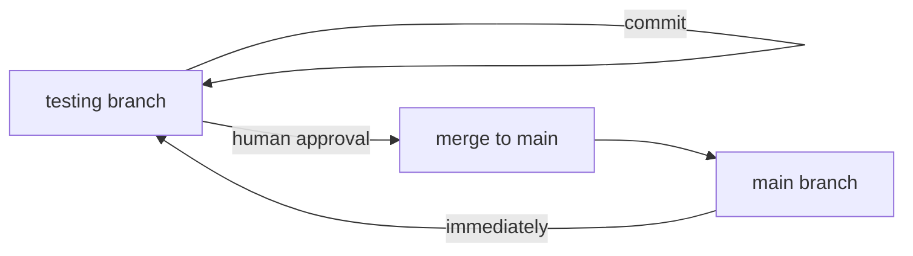

# Branch Protection System

## Overview

This repository implements a comprehensive branch protection system to prevent accidental modifications to the `main` branch. The protection applies to both human developers and AI coding agents.

For setting up branch protection on new repositories, see `create-branch-protections.prompt.md`.

## Protection Layers

### 1. Git Hooks (Human Protection)

Three Git hooks are installed to protect the main branch:

#### Pre-Commit Hook (`.git/hooks/pre-commit`)

- **Purpose**: Prevents direct commits to main branch
- **When it runs**: Before every commit
- **What it does**:
  - Checks if current branch is `main`
  - Blocks commit if on main (unless during merge)
  - Provides clear error message with instructions

#### Post-Checkout Hook (`.git/hooks/post-checkout`)

- **Purpose**: Warns when switching to main branch
- **When it runs**: After checking out a branch
- **What it does**:
  - Detects when user switches to main
  - Displays warning about branch protection
  - Reminds user main is only for merges
  - Requires acknowledgment (press Enter)

#### Post-Merge Hook (`.git/hooks/post-merge`)

- **Purpose**: Reminds to switch back after merging
- **When it runs**: After completing a merge
- **What it does**:
  - Detects if merge happened on main
  - Reminds user to switch back to testing
  - Prevents accidental continued work on main

### 2. AI Agent Protection (`.agents/branch_protection.py`)

Python script that AI agents must run before making any file modifications.

**Features:**

- Checks current Git branch
- Allows modifications only on non-main branches
- Exception: Allows during active merge operations
- Provides clear error messages for protection violations

**Usage:**

```bash
python .agents/branch_protection.py
```

**Exit codes:**

- `0`: Protection check passed, modifications allowed
- `1`: Protection violation, modifications blocked

### 3. Memory File Rules (`.agents/memory.instruction.md`)

AI agent instructions include mandatory branch protection checks:

- Must verify branch before any file operations
- Must refuse changes when on main branch
- Only assist with merges when explicitly authorized
- Must remind human to switch back after merges

## Branch Workflow

### Development Workflow



### Rules

1. **All development happens on `testing` branch**
   - Create features
   - Fix bugs
   - Write tests
   - Commit changes

2. **Main branch is read-only except for merges**
   - No direct commits
   - No direct file edits
   - Only receive merges from testing

3. **Merging process**

   ```bash
   # On testing branch - ensure everything is committed
   git checkout testing
   git status  # Verify clean state

   # Switch to main and merge
   git checkout main
   git merge testing

   # Immediately switch back
   git checkout testing
   ```

## AI Agent Rules

### Before Any File Modification

AI agents must follow this protocol:

```python
# 1. Check current branch
current_branch = subprocess.run(
    ["git", "branch", "--show-current"],
    capture_output=True,
    text=True
).stdout.strip()

# 2. Verify not on main (unless merge authorized)
if current_branch == "main":
    # Check if human explicitly authorized merge
    if not explicit_merge_authorization:
        print("❌ Cannot modify files on main branch")
        print("Please switch to testing: git checkout testing")
        exit(1)

# 3. Or use the protection script
subprocess.run(["python", ".agents/branch_protection.py"], check=True)
```

### Merge Assistance Protocol

AI agents may only assist with merges when:

1. **Human explicitly requests**: "help me merge", "merge testing to main", etc.
2. **Human is on main branch**: `git branch --show-current` shows "main"
3. **Clear merge intention**: Not ambiguous or part of other work

**Merge assistance steps:**

```bash
# AI guides human through:
git checkout main        # Switch to main
git merge testing        # Merge testing branch
git checkout testing     # Switch back immediately
```

### Prohibited AI Actions on Main

❌ Creating files
❌ Editing files
❌ Deleting files
❌ Running modification commands
❌ Installing dependencies
❌ Running build scripts that modify files
❌ Any operation that changes repository state

### Allowed AI Actions on Main

✅ Reading files for analysis
✅ Running read-only commands (status, log, diff)
✅ Assisting with merge (when explicitly authorized)
✅ Providing information about main branch

## Testing the Protection

### Test 1: Prevent Commit to Main

```bash
git checkout main
echo "test" > test.txt
git add test.txt
git commit -m "test"
# Expected: Pre-commit hook blocks with error message
```

### Test 2: Warning on Checkout

```bash
git checkout main
# Expected: Post-checkout hook displays warning, requires Enter
```

### Test 3: Reminder After Merge

```bash
git checkout main
git merge testing
# Expected: Post-merge hook reminds to switch back
```

### Test 4: AI Protection Script

```bash
git checkout main
python .agents/branch_protection.py
# Expected: Exit code 1 with protection violation message

git checkout testing
python .agents/branch_protection.py
# Expected: Exit code 0 with success message
```

## Troubleshooting

### Hook Not Running

If Git hooks don't execute:

```bash
# Verify hooks exist
ls -la .git/hooks/

# Verify executable permissions
ls -l .git/hooks/pre-commit
ls -l .git/hooks/post-checkout
ls -l .git/hooks/post-merge

# Make executable if needed
chmod +x .git/hooks/pre-commit
chmod +x .git/hooks/post-checkout
chmod +x .git/hooks/post-merge
```

### Accidentally on Main Branch

If you find yourself on main branch:

```bash
# Check for uncommitted changes
git status

# If changes exist and should be on testing:
git stash                    # Save changes
git checkout testing         # Switch to testing
git stash pop               # Restore changes

# If no changes:
git checkout testing         # Just switch
```

### Merge Conflicts

If merge conflicts occur:

```bash
# On main branch after conflict
git status                   # See conflicting files
# Resolve conflicts in editor
git add <resolved-files>
git commit                   # Complete merge
git checkout testing         # Switch back immediately
```

## Bypassing Protection (Emergency Only)

In extreme emergencies, protections can be bypassed:

```bash
# Bypass pre-commit hook (NOT RECOMMENDED)
git commit --no-verify

# Temporarily disable hooks
mv .git/hooks/pre-commit .git/hooks/pre-commit.disabled
```

**⚠️ WARNING**: Only bypass protections if you understand the consequences and have explicit authorization.

## Customization

### Adding Additional Protected Branches

Edit `.git/hooks/pre-commit`:

```bash
if [ "$BRANCH" = "main" ] || [ "$BRANCH" = "production" ]; then
    # Protection logic
fi
```

Edit `.agents/branch_protection.py`:

```python
PROTECTED_BRANCHES = ["main", "production"]

if current_branch in PROTECTED_BRANCHES:
    # Protection logic
```

### Modifying Warning Messages

Edit the respective hook files in `.git/hooks/` to customize messages.

## Summary

This multi-layered protection system ensures:

1. **Humans can't accidentally commit to main** (Git hooks)
2. **Humans are warned when on main** (Git hooks)
3. **Humans are reminded to switch back** (Git hooks)
4. **AI agents can't modify main** (Python script + memory rules)
5. **AI agents assist safely with merges** (Authorization protocol)

All modifications must happen on `testing` branch, with main reserved exclusively for receiving tested, approved merges.
